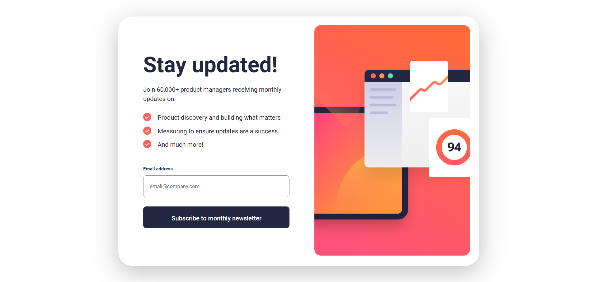
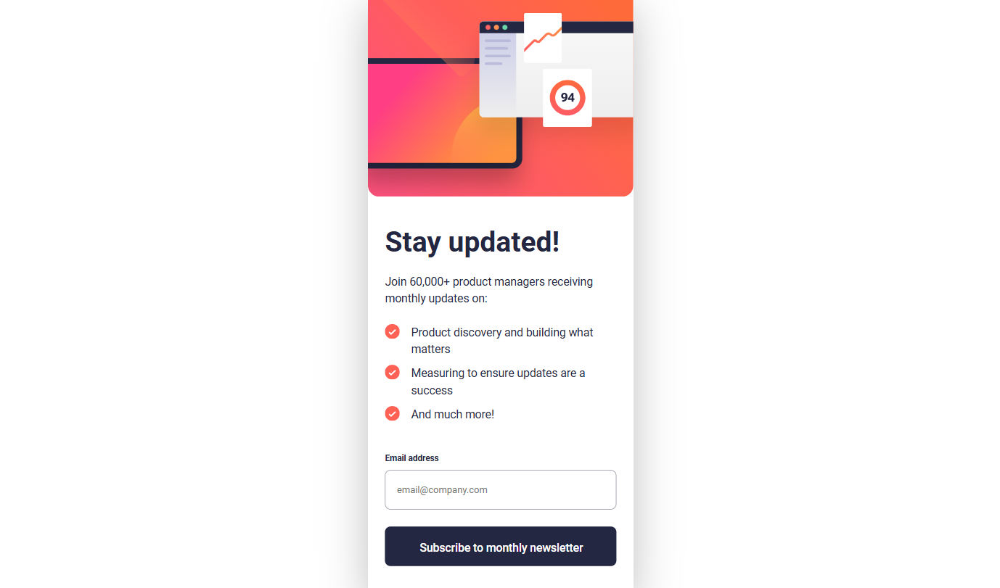

# Frontend Mentor - Newsletter sign-up form with success message solution ✅


This is a solution to the **[Newsletter sign-up form with success message challenge on Frontend Mentor](https://www.frontendmentor.io/challenges/newsletter-signup-form-with-success-message-3FC1AZbNrv)** by **[Dacardonac](https://github.com/Dacardonac)**. Frontend Mentor challenges help you improve your coding skills by building realistic projects.

## Table of contents 📄

- **[Frontend Mentor - Newsletter sign-up form with success message](#frontend-mentor---newsletter-sign-up-form-with-success-message-solution-)**
  - **[Table of contents](#table-of-contents-)**
  - **[Overview](#overview-)**
    - [The challenge](#the-challenge-)
    - [Screenshot](#screenshot-)
    - [Links](#links-)
    - [How to use](#how-to-use-the-project-)
  - **[My process](#my-process-)**
    - [Built with](#built-with-)
    - [What I learned](#what-i-learned-)
    - [Continued development](#continued-development-)
    - [Useful resources](#useful-resources-)
  - **[Author](#author-)**
  - **[Acknowledgments](#acknowledgments-)**

## Overview

### The challenge 🧩

**Users should be able to see in this project:**

- View the optimal layout depending on their device's screen size (Responsive)
- Styles in Components (Sass/Scss)
- DOM (Document Object Model)
- BEM Methodology (Block Element Modifier)
- Alerts

### Screenshots 📷

Desktop

****

Mobile

****

### Links 📍

- Solution URL: **[Frontend Mentor Solution 👨‍💻]()**
- Live Site URL: **[Solution Deploy in Vercel 🚀]()**

### How to Use the Project 💻

To use this project, you need to follow these steps:

1. **Clone the repository**:

  ```bash
  git clone https://github.com/Dacardonac/fem-newsletter-sign-up-form.git
  ```

2. **Navigate to the project directory**:

  ```bash
  cd newsletter-sign-up-form
  ```

3. **Install dependencies: Make sure you have Node.js installed, then run**:

  ```bash
  npm install
  ```

4. **Run the project: Start the development server with**:

  ```bash
  npm run dev
  ```
  This will start the project locally, typically accessible at `http://localhost:3000`.


5. **Start the JSON server: To simulate a backend for data collection, run**:

  ```bash
  npx json-server --watch db.json --port 3001
  ```
  This will start the JSON server on `http://localhost:3001`.

Now you can view the project in your browser and test its functionality, including form submissions that will be stored in `./assets/db/db.json`.


## My process 🎓

### Built with 🛠

- Semantic HTML5 Markup - Structure
- CSS3 Custom Properties - Styles
- Mobile-first Workflow
- JavaScript - Programming Logic
- Flexbox - Spaces and Alignments
- Conventional Commits - Commit Specification
- json-server - Backend (Data Base)
- [Vite](https://vitejs.dev/) - Frontend Tooling
- [Sass/Scss](https://sass-lang.com/) - Modules and Styles
- [BEM Methodology](https://en.bem.info/methodology/) - Nomenclature for Classes
- Markdown - README.md file (Documentation)

### What I learned 🧠

With this project I learned, implemented and practiced Javascript, along with its properties and methods for alerts or success messages when submitting the form. I also reinforced and practiced my knowledge of CSS3 with Sass, I worked on semantic HTML5 while applying the BEM methodology for class naming and on my own I wanted to manage the data collected from the form in a JSON file, thus simulating a database with json-server.

**You can see an example below:**

``` JavaScript
async function sendEmail(email) {
  try {
    const response = await fetch('http://localhost:3000/emails', {
      method: 'POST',
      headers: { 'Content-Type': 'application/json' },
      body: JSON.stringify({ email })
    });

    if (!response.ok) throw new Error('Network response was not ok');

    formInput.value = '';
    showMessage();
  } catch (error) {
    console.error('Error:', error);
  }
}
```

### Continued development 🔎

With this path, I want to continue learning more about **JavaScript**, **Responsive Design** and how to work across different devices with **Flexbox** and **Grid**, also I want continue using  **BEM methodology** and perfect the technique in aspects like name the classes, also I want to improve in modularize the component's styles with **Sass** and learn about **Conventional Commits**.

### Useful resources 🛠

- **[MDN](https://developer.mozilla.org/en-US/)** - This helped me with **Documentation** on many topics, mostly with **HTML** and **CSS** properties.
- **[ChatGPT](https://chatgpt.com/)** - This is an incredible **Artificial Intelligence (AI)** tool, **ChatGPT** helps me with **specific topics**, **errors in the project** and **investigations**.

## Author 👨‍💻

- Frontend Mentor - **[@Dacardonac](https://www.frontendmentor.io/profile/Dacardonac)**
- LinkedIn - **[@Daniel Alejandro Cano Cardona](https://www.linkedin.com/in/daniel-alejandro-cano-cardona/)**

## Acknowledgments

I want to thank **[Jairovg](https://github.com/jairovg)** for the teachings and his help to complete this challenge in a good way and with good practices.

**Have fun building!** 🚀
